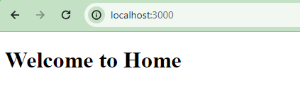
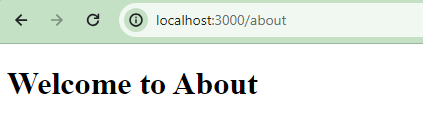
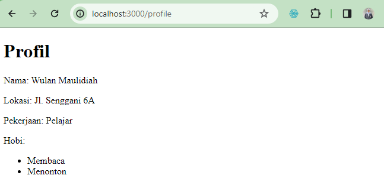

This is a [Next.js](https://nextjs.org/) project bootstrapped with [`create-next-app`](https://github.com/vercel/next.js/tree/canary/packages/create-next-app).

## Getting Started

First, run the development server:

```bash
npm run dev
# or
yarn dev
# or
pnpm dev
# or
bun dev
```

Open [http://localhost:3000](http://localhost:3000) with your browser to see the result.

## Laporan Praktikum Week 5
Nama : Wulan Maulidiah <br>
NIM : 2341728038 <br>
Kelas : TI 3A

1. Halaman Home
    
    Halaman About
    
    Halaman Profile
    
    
2. 
## Deploy on Vercel
