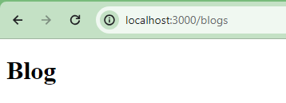
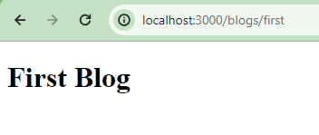
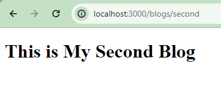
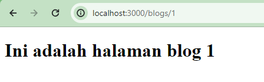
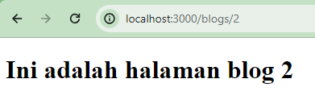
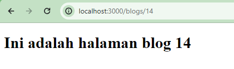
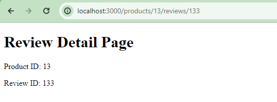
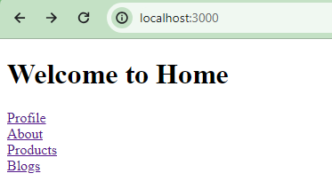

This is a [Next.js](https://nextjs.org/) project bootstrapped with [`create-next-app`](https://github.com/vercel/next.js/tree/canary/packages/create-next-app).

## Getting Started

First, run the development server:

```bash
npm run dev
# or
yarn dev
# or
pnpm dev
# or
bun dev
```

Open [http://localhost:3000](http://localhost:3000) with your browser to see the result.

## Laporan Praktikum Week 5
Nama : Wulan Maulidiah <br>
NIM : 2341728038 <br>
Kelas : TI 3A

1. Halaman Home <br>
     

    Halaman About <br>
    

    Halaman Profile <br>
    
    
2. Halaman Blogs <br>
    

    Halaman Blogs/First<br>
    

    Halaman Blogs/Second <br>
    

    Menurut saya, terdapat risiko yang dapat mungkin terjadi dengan konflik nama file jika setiap halaman memiliki nama file yang sama 'page.tsx' di dalam folder yang berbeda. Karena hal tersebut dapat menyebabkan kebingungan atau masalah dalam manajemen kode.

3. Halaman Blogs dengan Dynamic Routes <br>
     <br>
     <br>
     <br>

    Membuat halaman /products/[productId]/reviews/[reviewId] <br>
    

4. Navigasi dengan link component <br>
    
## Deploy on Vercel
